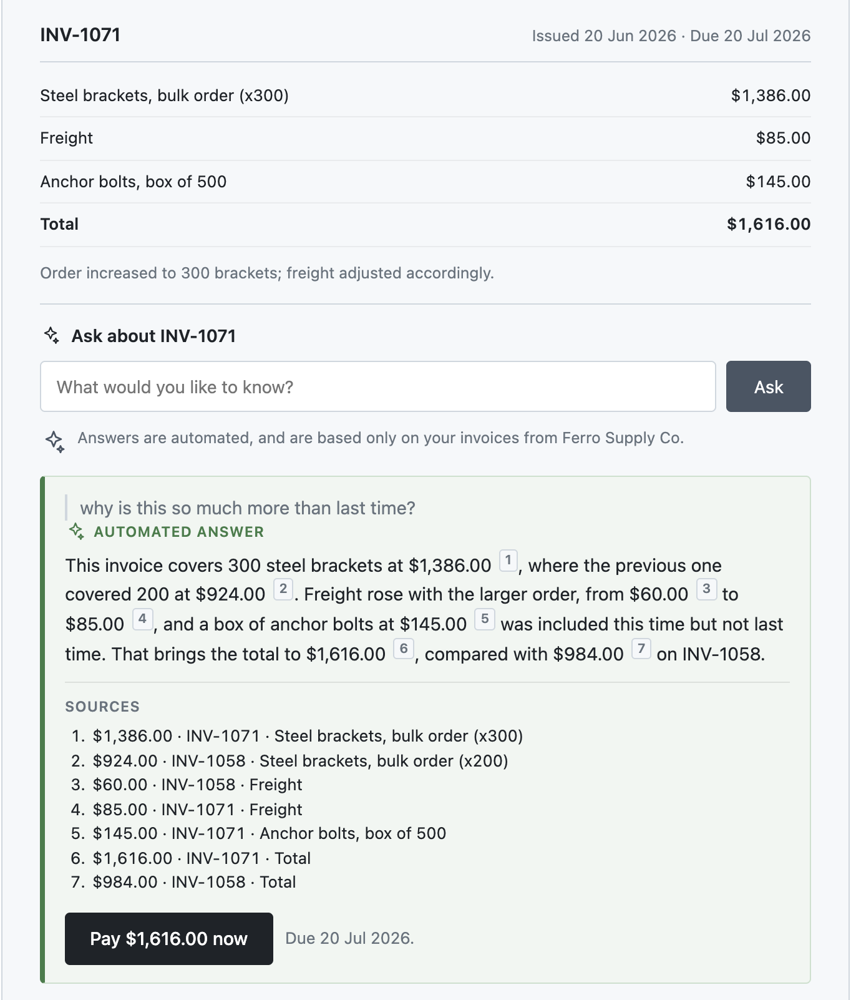

# Invoice Q&A prototype

This is a working prototype of a self-service Q&A feature for a customer-facing invoice portal. The end user (a payer) asks a plain-language question about their invoice and gets an answer **grounded in their invoice records**: where the data exists, every fact and figure in the answer is cited back to the specific line item it came from.



The point of this feature is to get invoices paid faster. People are slow to pay invoices they don't understand. Some will ask the merchant by email or phone and then wait; others mean to ask and never do, so the invoice sits unpaid and nobody ever hears the question. This answers it while the payer is still looking at the invoice, and offers the two things that move payment forward: pay now, or write to the merchant about whatever understanding the invoice can't settle.

Invoices are the specific context here, but the shape of the problem is general: open-ended questions asked by end users, and answers bounded by records the organisation already holds.

The prototype and the spec in [`docs/invoice_qa_feature_spec.md`](docs/invoice_qa_feature_spec.md) were built against each other, and both changed in the process. Further down, a table maps each acceptance criterion to the code that implements it and how to check it.

---

## Why this repo exists

This is a proof of concept rather than a product. The data is entirely fictional and fixed. It was built with Claude Code to explore how a draft spec and a prototype develop against each other: the spec was drafted first, building against it tested the requirements, and the issues that surfaced went back into the spec.

Speed matters here. Building a working feature used to cost enough that nobody would do it to interrogate a draft. You finished the spec, handed it over, and found out what was wrong from engineering. Building something like this takes a day or two at most, which makes a prototype cheap enough to use as a drafting tool rather than something you only get once the spec is finished.

Working this way puts something running in front of customers, product architects and engineering leads while the spec is still a draft. What reaches engineering after a short validation loop is a spec whose product-side questions have already been answered. What's still open belongs to engineering, architecture and legal, and each open question is framed so the acceptance criteria hold whichever way it resolves. The alternative is finding all of it mid-sprint, after engineering has committed to a date.

---

## Run it

**Prerequisites:** Node 18+ and an Anthropic API key ([console.anthropic.com](https://console.anthropic.com/settings/keys)). The offline evals below need neither. A full evaluation session costs a few cents.

```bash
npm install
cp .env.example .env      # then paste your key into .env
npm start
```

Open <http://localhost:3000>.

The key is read server-side only and is never sent to the browser. If it's missing, the terminal warns you at startup, and any question comes back with a message naming the fix and no Retry button, since retrying cannot produce a key.

---

## What it does

Open an invoice and you see its line items, fees and total. Ask a question about it and the answer comes from that invoice's records, with each figure cited to the line it came from.

The question is always about the invoice on screen. There's no picker and no way to ask across the whole account, so an answer can never attach to the wrong invoice. Account-wide questions are a plausible second version.

The data is one fictional customer, Marrow & Co., buying industrial parts from Ferro Supply Co. Their invoice history is deliberately uneven so there's something to ask about: a late fee, an added line item, a supplier price rise, a larger order, one invoice flagged as contested, and one old enough to fall outside the 12-month retrieval window. The next section suggests where to start.

Each invoice also has a **Simulate a system failure** button, marked on screen as *Prototype control, not part of the feature*. It's there for testing only, and a real customer would never see it. One of the criteria is that an outage must look nothing like a decline, and the only way to check that is to look, so a reviewer needs a way to cause one on demand.

### How a question is handled

```
question
   │
   ├─ authorization check ─────────────► generic "couldn't find that invoice"
   │
   ├─ classify intent (Claude, structured output)
   │      │
   │      ├─ dispute ───────────────────► never answered; offer a route to a person
   │      ├─ contact request ───────────► offer to write to the merchant
   │      ├─ cross-merchant ────────────► disclosed as out of scope
   │      └─ nothing actually asked ────► say what the assistant is for, and stop
   │
   ├─ retrieve (bounded to 12 months)
   │
   └─ answer (Claude, structured output)
          ├─ grounded ──────────────────► answer + inline citations
          ├─ no supporting records ─────► "can't answer confidently"
          └─ no prior invoice ──────────► "nothing earlier to compare"
```

A model classifies the question and ordinary code decides what happens next. Disputes, contact requests, cross-merchant questions and messages that don't ask anything are all settled in code before the answering model is called, so it never sees them. It isn't trusted to spot a dispute and refuse on its own, because in a financial context a confident wrong answer is worse than no answer.

Both model calls use Claude because the prototype was built with it. Which model production uses, and whether the two calls need the same one, is an engineering decision.

---

## Try it

The evals further down check the requirements automatically. This section contains some starting point suggestions for exploring the prototype.

### A quick tour

- Open **INV-1014** and ask *"why was I charged a late fee?"* You get an explanation from the invoice, with each figure linked to the line it came from.
- Open **INV-1071** and ask *"when will my next order ship?"* The invoice doesn't say, so it tells you it can't answer and offers to help you write to the merchant.
- Open **INV-1071** and say *"I never received this shipment, I want a refund."* It doesn't try to answer, and nothing is sent on your behalf. It explains that disputes are for the merchant and offers to help you write to them.
- Inside any invoice, click **Simulate a system failure** and compare what you see with the decline above.

### Then try to break it

The quick tour confirms the prototype does what the spec says. That's the smaller part of what it's for. The bigger part is finding where the spec itself is wrong, and that only happens when people ask their own questions in their own words.

It helps to push where the system has to make a judgement call:

- **Mix a question with a complaint.** *"Why was the freight so high? I want it refunded."* Anything that reads as a dispute isn't answered, even if it also asks something factual. Is that the right call for what you asked?
- **Ask a follow-up.** Ask something, then *"and the one before that?"* Each question is answered on its own, with no memory of the last, so a follow-up that can't stand alone is declined. Would a customer expect that?
- **Start from a wrong assumption.** Open **INV-1042** and ask *"why did this go up?"* Nothing went up. Does it say so, or play along?
- **Ask something the invoice can't know.** *"What discount will you give me next quarter?"* That's a real question the records can't answer, so it should be declined, not brushed off as small talk.
- **Just vent.** *"This supplier is useless."* There's no question in it, so it says what it's for and stops. It deliberately doesn't offer to forward what you wrote, since that would make it easy to send an angry message to a supplier you still have to deal with.
- **Say the same thing three ways.** Do the answers agree?

**What counts as a finding.** Anything that surprises you, including a response that follows the spec and still feels wrong. Note the invoice, what you asked, and what you expected. Several of the spec's fourteen changes started exactly like that. In one, a customer asking about a late fee got a correct answer and was then offered only a conversation with the merchant, on an invoice they could have paid in one click. The system was working as specified, so the fix went into the spec as AC13, and AC13 now has eval cases so the fix stays fixed. [`docs/decisions.md`](docs/decisions.md) records all fourteen changes.

---

## Where each requirement lives

| Spec | Requirement | Code | How to check |
|---|---|---|---|
| **AC1** | Answers cite every figure | `server.js` → `answer()`, `ANSWER_SCHEMA` | INV-1014 by hand; OFF-15 |
| **AC2** | Declines when the records can't answer | `lib/core.js` → `decidePostAnswer()` | INV-1071 by hand |
| **AC3** | Says when there's nothing earlier to compare | `lib/core.js` → `decidePostAnswer()` | INV-1001 by hand |
| **AC4** | Never answers a dispute | `lib/core.js` → `decidePreAnswer()` | INV-1071 by hand; OFF-01, OFF-02 |
| **AC5** | An outage looks unlike a decline | `server.js` catch → `app.js` retry counter | Failure button; ON-18 |
| **AC6** | Checks ownership before retrieval | `lib/core.js` → `authorizeInvoice()`, `payerVisible()` | OFF-19, ON-20 (stubbed) |
| **AC7** | Only the invoice on screen | `app.js` → `askPanel()` | DOM-13 |
| **AC8** | Switching invoice clears the answer | `app.js` → `select()`, `drafts`, `clearDraft()` | DOM-03 to DOM-06 |
| **AC9** | Answers labelled as automated | `index.html` → `.disclosure`; `app.js` → `labelFor()` | DOM-11 |
| **AC10** | One route to a person | `server.js` → `/api/route-to-merchant`; `app.js` → `routeAction()` | Any invoice by hand |
| **AC11** | Confirmed only when accepted | `server.js` → `/api/route-to-merchant`; `app.js` → `send()` catch | ON-14, ON-15, DOM-08 |
| **AC12** | Nothing sent without a choice | `app.js` → nothing fires without a click | ON-17, DOM-07 |
| **AC13** | Pay offered on unpaid invoices | `lib/core.js` → `offersPayment()`, `paymentIsPrimary()` | OFF-20, DOM-09, DOM-12 |
| **AC14** | Confirm before sending, never twice | `server.js` → dedupe guard; `app.js` → `confirmStep()`, `sentList()` | ON-21, DOM-01, DOM-02, DOM-07 |
| Non-Goal | 12-month history window | `lib/core.js` → `windowCutoff()` | INV-1071 by hand; OFF-08 |
| Non-Goal | Other merchants out of scope | `lib/core.js` → `decidePreAnswer()` | Any invoice by hand |
| Edge case | Partial data means a decline | `answer()` system prompt, rule 3 | Not yet exercised. ON-10 checks that no figure is guessed, but both records exist in this data, so the decline never triggers |

---

## Evals

The evals are 55 cases, each pairing a question or situation with what an acceptable response looks like. Because the model's wording varies from run to run, they check properties of a response, such as whether every figure is cited, not its exact text. There are two sets.

```bash
npm install && npm run eval:offline    # 33 evals, no API key or server needed, runs in seconds
npm run eval                           # all 55, including 22 against the live model (needs a key and the server running)
```

**Offline: the rules that don't depend on the model.** Some behaviour is fixed in code: a dispute never reaches the answering model, nothing older than 12 months is retrieved, the merchant's internal notes are stripped before anything reaches the screen or the model, and a disputed invoice never offers a Pay button. These evals run without calling a model. They feed the code fixed stand-ins for its output, such as a question pre-labelled as a dispute or a sample answer with an uncited figure, and check the code handles each correctly, so the rules hold whatever the model says.

Thirteen of them load the page in a simulated browser (jsdom) and click through it. Three bugs found by hand in one afternoon were all combinations of rules that were each fine on their own, so these check guarantees across every combination: a sent message shows exactly once, a second message never replaces the first, typed text is never lost unless the customer deletes it, and an answer always belongs to the invoice on screen. [`evals/state-model.md`](evals/state-model.md) sets out the combinations and [`evals/dom.js`](evals/dom.js) tests them.

**Online: what the model actually did.** Eighteen evals send a question end to end through the app and the live model and check what comes back: figures cited, declines where it can't answer, disputes recognised. Four more test sending a message to the merchant. A pass means it behaved on this run, not that it always will.

```
  PASS  OFF-01  AC4      Dispute intent never reaches the answer path
  PASS  OFF-08  Window   Retrieval is bounded to the 12-month window
  PASS  OFF-15  AC1      Groundedness check catches an uncited figure
  PASS  DOM-01  INV1     The sent record appears exactly once, in every state
  PASS  DOM-09  INV6     Payment and routing match the state model, in order
  ...
  33/33 passed
```

Each case is tagged with the acceptance criterion it covers, in [`evals/cases.json`](evals/cases.json). The table above maps criteria to cases.

**Check the evals can fail.** Change the dispute check in `lib/core.js` to `if (false)` and run the offline set. OFF-01 and OFF-02 fail and give the reason.

**What a green run doesn't tell you.**

- Whether an answer reads well or is useful. That needs a person; see "Try it".
- Whether a figure is cited to the *right* line. The check only confirms each figure has a citation.
- Whether it's ready to release. The spec's release gate is a golden set of at least 50 questions, run in CI before any prompt, model or retrieval change ships, with at least 99% of facts traced to a source. These 55 are run by hand.

When exploring turns up a problem with the spec, the fix gets a case here, so it can't quietly break again.

---

## How the spec was produced

The spec was drafted first, then put through [`pm-spec-workflow`](https://github.com/J-Hunniford/pm-spec-workflow), a spec review tool I built in Claude Code (private repo). Up to eight AI reviewers read it in parallel, each checking one thing: whether the criteria can be tested, whether the scope is clear, whether the language is vague, whether edge cases are covered, and so on. Their findings become a short set of questions for the PM. The reviewers only judge; a separate step rewrites the spec once those questions are answered.

**Building the prototype then changed the spec fourteen more times.** A review is good at spotting requirements that can't be tested. It's much worse at spotting ones that are testable and simply wrong, and building the feature finds those. The clearest example: AC4 told the customer their dispute had been flagged for the merchant's support team, when nothing had been sent anywhere. A developer would have built exactly that, and every customer raising a dispute would have been told something untrue.

These were mistakes in the requirements, not the code. Finding them at this stage costs hours; finding them after engineering has built to the spec costs weeks. [`docs/decisions.md`](docs/decisions.md) lists all fourteen changes.

---

## What's stubbed, and what's real

Everything listed under *Where each requirement lives* is real code. These are the places where the prototype stands in for something the real platform would provide.

**Authorization.** There's only one hardcoded customer, so `authorizeInvoice()` can't do a real ownership check. It still runs before anything is retrieved, and the message it gives, "couldn't find that invoice", never confirms whether an invoice exists. In production it would compare the invoice's customer with the logged-in one.

**Retrieval.** The data is a fixed JSON file, so retrieval is a simple filter and nothing is saved when the server restarts. A production version would use a proper index.

**Payment.** Taking payment is a Non-Goal. The Pay button in the Q&A sends you to the payment panel on the right, which stands in for the portal's own payment flow, and highlights it. Press that panel's button and it tells you payment is out of scope for the prototype.

**The invoice view.** It's deliberately basic, and only there so the Q&A has an invoice to sit inside.

**The feature name.** "Ask" is a placeholder. Naming a customer-facing feature is a decision for product, marketing and leadership after a proof of concept, which is why no name appears in the acceptance criteria.

**Model choice.** Both calls use `claude-opus-5`, with the classifier set to low effort because it's a narrow labelling task.

Product decisions live in the spec, not here. What v1 leaves out is in its Non-Goals, and what's still undecided, such as which system delivers messages to the merchant, is in its Open Questions.

---

## Layout

```
├── server.js                 # web server and both Claude calls
├── lib/
│   └── core.js               # routing, retrieval window, authorization, citation check
│                             #   pure functions, so the rules can be tested without a model
├── evals/
│   ├── cases.json            # eval cases, each tagged with its acceptance criterion
│   ├── state-model.md        # what the browser must show, in every combination
│   ├── dom.js                # tests that model in a simulated browser (jsdom)
│   └── run.js                # runs the offline and online sets
├── public/                   # the single-page interface
│   ├── index.html
│   ├── app.js                # screen states, retry logic, message writing
│   └── styles.css
├── data/
│   └── synthetic_invoice_data.json   # the fictional invoices, plus test questions and notes
└── docs/
    ├── invoice_qa_feature_spec.md    # the spec
    ├── decisions.md                  # what changed in the spec, and why
    └── answer-with-citations.png     # the screenshot at the top of this README
```

`data/synthetic_invoice_data.json` includes a `test_notes` section saying which invoice to open for the less obvious questions, and what each one is meant to show. Worth a look before you start exploring.
